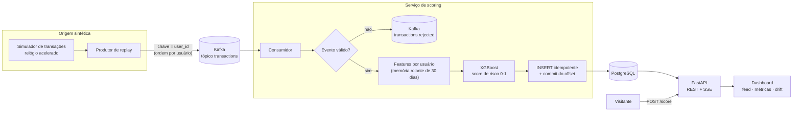
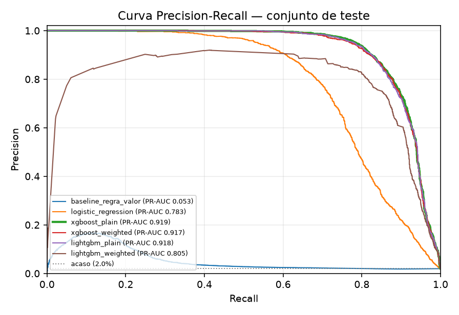
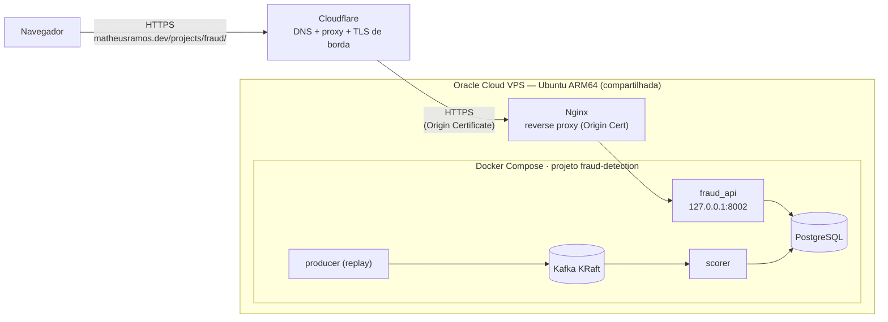

# Real-Time Fraud Detection System

Sistema de detecção de fraude em tempo real, do evento ao painel: transações entram por um tópico **Kafka**, um serviço calcula features por usuário, um modelo **XGBoost** dá o score de risco, tudo é gravado no **PostgreSQL** e um dashboard mostra o feed ao vivo, a qualidade do modelo e o **drift** — rodando numa VPS e com métricas reproduzíveis por script.

**Demo ao vivo**: [https://matheusramos.dev/projects/fraud/](https://matheusramos.dev/projects/fraud/) — feed de transações pontuadas em tempo real, gráficos operacionais, comparação de modelos, indicador de drift e um formulário para você montar uma transação e ver o score (com as features que mais pesaram).

> **Dados 100% sintéticos.** O feed vem de um simulador (com o *relógio acelerado*, ver [Trade-offs](#trade-offs-e-decisões-de-design)). Nenhum dado pessoal ou financeiro real é usado, e o modelo não deve ser usado com dados reais — ver [Limitações](#limitações-e-o-que-eu-não-afirmo).

## O problema

Fraude é rara (aqui ~2% das transações), cara de deixar passar e cara de bloquear por engano. Isso muda tudo em relação a um problema de classificação "normal": acurácia é inútil (não sinalizar nada já "acerta" 98%), o threshold de decisão é uma decisão de negócio, e o comportamento do usuário (velocidade das transações, dispositivo novo, viagem impossível) importa mais que a transação isolada. O projeto responde a quatro perguntas de entrevista de ML Engineer:

1. **Como você sabe que funciona?** Split temporal, métricas de classe rara, threshold escolhido *sem olhar o teste*, comparação contra baselines e um artefato cujo resultado é reproduzido por script.
2. **O que acontece em produção?** Streaming de verdade (Kafka → scorer → PostgreSQL), features stateful idênticas no treino e no serving, latência medida.
3. **E se os dados mudarem?** Monitoramento de drift por PSI, validado injetando um deslocamento.
4. **Você entrega?** Docker Compose numa VPS compartilhada, isolado dos outros projetos, com a demo pública em `matheusramos.dev`.

## Como funciona



**Features (18)**, calculadas por uma *única* máquina de estados usada no treino e no serving: valor e desvio do valor em relação ao histórico do usuário, contagem de transações em 1 min / 10 min / 1 h / 24 h / 30 dias (velocity), tempo desde a última transação, dispositivo/cidade/país/merchant "novo" (não visto nos últimos 30 dias), distância e **velocidade implícita** desde a última transação (viagem impossível), categoria do merchant e hora do dia.

**Garantias do pipeline**
- *At-least-once + escrita idempotente*: o offset só é commitado depois de gravar; reentrega não duplica registro nem conta duas vezes no estado do usuário.
- *Eventos inválidos* vão para um tópico dead-letter e o consumo continua.
- *Recuperação*: o estado do usuário é reconstruído do PostgreSQL. Testei derrubando o scorer com `kill -9` no meio do fluxo: **1.090 publicados = 1.090 persistidos = 1.090 ids distintos**.

## Resultados

Dados sintéticos: 2.000 usuários × 60 dias (558 mil transações, 2% de fraude), **split temporal 60/20/20** (o teste é o futuro), seed 42. O threshold de cada modelo é escolhido **na validação** — maior recall com FPR ≤ 1% — e o teste só reporta.

| Modelo | PR-AUC | Precision | Recall | F1 | FPR |
|---|---|---|---|---|---|
| **XGBoost (servido)** | **0,919** | 65,6% | 91,7% | 0,765 | 0,96% |
| LightGBM | 0,918 | 64,8% | 91,6% | 0,759 | 1,00% |
| XGBoost (peso de classe) | 0,917 | 65,3% | 91,8% | 0,763 | 0,98% |
| LightGBM (peso de classe) | 0,805 | 64,8% | 88,1% | 0,747 | 0,96% |
| Regressão logística | 0,783 | 61,2% | 75,8% | 0,677 | 0,96% |
| Regra “valor alto = suspeito” | 0,053 | 15,7% | 8,5% | 0,111 | 0,92% |



A regra ingênua de valor mal supera o acaso (PR-AUC 0,053 contra 0,0196 de prevalência): fraude aqui não é "compra cara". O ganho vem do comportamento — o boosting captura interações que a regressão logística não captura (+0,14 de PR-AUC).

**O que o modelo pega — e o que não pega** (recall por padrão de fraude, conjunto de teste):

| Padrão injetado | Recall |
|---|---|
| `velocity` — rajada de compras em minutos | 98,5% |
| `impossible_travel` — outra cidade em < 90 min | 97,7% |
| `new_device` — dispositivo nunca visto | 96,1% |
| `amount_spike` — valor muito acima do histórico | 93,7% |
| `low_and_slow` — valor, local e dispositivo normais | **45,7%** |

`low_and_slow` é *por construção* quase indistinguível de uma compra legítima (só o merchant novo e o horário destoam): é o teto honesto de recall deste problema, e por isso o recall geral fica em ~92% e não em ~100%.

**Produção, medida ao vivo** (stack completo no Docker, feed sintético rotulado: 24–31 mil transações por janela):

| Métrica | Valor |
|---|---|
| Latência de scoring (publicação no Kafka → persistido), tráfego ao vivo | **p50 25 ms · p95 28 ms** |
| Qualidade ao vivo contra o rótulo do simulador | precision 66-67% · recall 90-92% (bate com o offline) |
| Vazão no aquecimento (1 scorer, 1 broker) | acompanha 250 eventos/s usando ~65% de um núcleo |
| Memória do stack inteiro (Kafka, Postgres, scorer, produtor, API) | ~735 MiB em regime · ~913 MiB de pico |
| Imagem Docker | 705 MB · dependências com wheel ARM64 |

**Monitoramento de drift** (PSI por feature contra a distribuição do treino; > 0,2 alerta):
- Tráfego normal: PSI máximo **0,06** — nenhum alerta.
- Injetando `amount × 4` no produtor: `amount` = 1,98, `amount_zscore_user` = 2,20, `amount_ratio_to_user_max` = 0,81 e o score = 0,81 → **alerta**, enquanto features que não mudaram (`km_from_last`, `is_new_device`) seguem estáveis.
- Estacionariedade: em uma simulação de 400 dias o PSI das features de histórico fica ≤ 0,025 (ver o problema que isso resolveu abaixo).

Reproduza: `python3 scripts/train.py` gera o artefato e `reports/`; `python3 scripts/evaluate.py` reavalia o artefato salvo e falha se algum número divergir do gravado.

**Como reproduzir as medições ao vivo** (com o stack no ar):
- *Latência e qualidade ao vivo*: `curl 'http://127.0.0.1:8002/stats?window_minutes=1'` (p50/p95 do tráfego ao vivo, depois do aquecimento) e `?window_minutes=15` (matriz de confusão contra o rótulo do simulador).
- *Drift*: `curl http://127.0.0.1:8002/drift` (PSI por feature). Para o experimento, ponha `REPLAY_DRIFT_FEATURE=amount` e `REPLAY_DRIFT_FACTOR=4` no `.env` e reinicie o produtor (`up -d producer`).
- *Memória/CPU*: `docker stats --no-stream`. *Recuperação*: `docker kill -s KILL fraud_scorer` com o produtor ativo e compare `select count(*), count(distinct transaction_id) from transactions` com a soma dos offsets do tópico.

## O que aprendi construindo (bugs reais que os testes/medições pegaram)

- **O modelo servido não era o modelo avaliado.** Com early stopping, o `save_model` gravava também as árvores treinadas *depois* do melhor ponto, então o modelo carregado dava precision 68,65% enquanto o avaliado dava 68,00%, e o threshold ficava calibrado no modelo errado. Só apareceu porque `evaluate.py` reavalia o artefato de forma independente. Corrigido (o artefato grava só até `best_iteration`) e coberto por teste para as duas famílias.
- **Features de "histórico acumulado" desalinham sozinhas.** A 1ª versão usava contagem total, valor máximo histórico e "merchant já visto". Medi em 400 dias simulados: PSI de `user_txn_count` > 0,3 já 12 dias depois da referência e a taxa de `is_new_merchant` caindo de 14,7% para 4,7% — o replay, rodando por semanas, dispararia alerta falso *e* degradaria o modelo. Troquei por **memória rolante de 30 dias** (bônus: estado por usuário limitado). Há um teste de regressão de estacionariedade.
- **Relógio acelerado × janela de drift.** No replay, 1 "dia" simulado dura ~19 min reais; uma janela de drift de 15 min cobre só parte do ciclo diurno e `hour_of_day` disparava (PSI 1,2) em tráfego normal. A janela passou a cobrir vários ciclos.
- **OpenMP em espera ativa.** O `DMatrix` do XGBoost usa todos os núcleos por padrão: o scorer marcava ~800% de CPU. Com `nthread=1` + `OMP_NUM_THREADS=1`, ~65% sob a mesma carga.
- **Rate limit atrás de proxy.** `request.client.host` atrás do Nginx é sempre o gateway do Docker (todos os visitantes dividiriam um bucket). O limiter usa `CF-Connecting-IP` → `X-Forwarded-For`, com teto global.

## Arquitetura de deploy



Só a API é publicada, e só em `127.0.0.1` (o Docker ignora o `ufw`); broker e banco ficam na rede interna. O Compose usa `name:` explícito, contêineres `fraud_*` e volumes próprios, para nunca interferir nos outros projetos da VPS. O bloco do Nginx (`infra/nginx/fraud-location.conf`) só *adiciona* uma `location` e remove o prefixo `/projects/fraud/`; o dashboard usa apenas URLs relativas e nenhum script/estilo inline, então funciona sob a CSP estrita do domínio (verificado num navegador real, sem violações). Passo a passo e rollback em [`docs/DEPLOY.md`](docs/DEPLOY.md).

## Stack

- **Streaming**: Apache Kafka (KRaft, 1 broker, heap limitado; tópico chaveado por `user_id`, 3 partições, dead-letter)
- **Modelo**: XGBoost / LightGBM / scikit-learn (comparação); artefato em formato nativo (sem pickle) + `meta.json` versionado no git
- **API**: FastAPI (REST + Server-Sent Events), rate limiting por visitante, servindo o próprio frontend
- **Dados**: PostgreSQL (escrita idempotente, retenção por janela e por nº de linhas)
- **Frontend**: HTML/CSS/JS sem build, gráficos em SVG próprio, tema claro/escuro, tabela equivalente para cada gráfico
- **Deploy**: Docker Compose numa VPS Oracle (ARM64), Nginx, Cloudflare

## Estrutura

```
app/
  data/        # simulador de transações sintéticas + schema + geografia
  features/    # máquina de estados de features (fonte única treino/serving)
  model/       # treino, métricas, threshold, artefato, drift (PSI)
  streaming/   # produtor de replay, consumidor/scorer, runtime
  storage/     # PostgreSQL: schema, escrita idempotente, consultas
  api/         # FastAPI, rate limit, SSE
  static/      # dashboard (index.html, style.css, app.js, charts.js)
models/        # artefato servido (model.json + meta.json)
reports/       # relatório de avaliação e curva PR (gerados por scripts/train.py)
scripts/       # generate_data, train, evaluate, run_scorer, run_producer, run_api
docker/        # Dockerfile, docker-compose.yml (+ override de dev)
infra/nginx/   # snippet de produção + Nginx de teste local com a CSP real
docs/          # DEPLOY.md, entrada do site
openspec/      # planejamento (proposta, specs, design, tarefas)
tests/         # 138 testes (unitários + integração com Kafka/PostgreSQL reais)
```

## Como rodar

**Ambiente** (Python 3.12; no macOS o XGBoost/LightGBM precisam do OpenMP: `brew install libomp`):

```bash
python3 -m venv .venv && source .venv/bin/activate
pip install -r requirements-train.txt
cp .env.example .env        # ajuste POSTGRES_PASSWORD
```

**Dados, treino e avaliação** (sem Docker):

```bash
python3 scripts/generate_data.py      # resumo do dataset sintético (2000 usuários × 60 dias)
python3 scripts/train.py              # treina, compara, escolhe, grava models/ e reports/
python3 scripts/evaluate.py           # reavalia o artefato e confere com o meta.json
```

**Stack completo** (Kafka + PostgreSQL + scorer + produtor + API), como em produção:

```bash
docker compose -f docker/docker-compose.yml --env-file .env up -d --build
open http://127.0.0.1:8002/         # o replay aquece ~5 min (histórico de 35 dias) e segue ao vivo
```

**Testes** (unitários + integração; os de Kafka/PostgreSQL usam o override de dev, que publica as portas em loopback, e se pulam sozinhos se o Docker não estiver de pé; use `POSTGRES_PASSWORD=fraud` no `.env` de dev ou exporte `TEST_DATABASE_URL`):

```bash
docker compose -f docker/docker-compose.yml -f docker/docker-compose.dev.yml --env-file .env up -d kafka postgres kafka-init
python3 -m unittest discover -s tests -v
```

**Validar o dashboard sob a CSP de produção** (Nginx local com os mesmos headers do domínio e o snippet real):

```bash
python3 scripts/run_api.py --host 0.0.0.0 --port 8002 &
./infra/nginx/run-local-nginx.sh     # http://127.0.0.1:8080/projects/fraud/
```

## Trade-offs e decisões de design

**Dados sintéticos em vez do dataset do Kaggle.** O dataset público mais usado tem features anonimizadas por PCA — nenhuma é valor/localização/dispositivo/merchant — e não permite replay ao vivo com estado por usuário. O custo é conhecido: o modelo aprende as regras do gerador (por isso `merchant_category_code` domina a importância, 32% do ganho: fraudadores preferem categorias de risco). Mitigado com padrões múltiplos, ruído e outliers legítimos (compra cara, dispositivo novo, viagem) para as classes se sobreporem; e declarado como limitação.

**Uma implementação de features, não duas.** O treino *reproduz o stream* pela mesma máquina de estados do serving, então não existe training/serving skew por construção (há teste de paridade com vetores exatamente iguais e uma referência de força bruta independente). Custo: o treino em loop Python é mais lento — o pipeline completo (gerar 558 mil eventos, features, 6 modelos) leva ~1,5 min, irrelevante offline.

**Threshold por critério de negócio, na validação.** Recall máximo sujeito a FPR ≤ 1%, escolhido só em dados de validação; F1 máximo ignoraria que falso alarme e fraude perdida têm custos diferentes. Os scores **não são probabilidades calibradas** (o dashboard chama de "risk score"); calibração isotônica fica como evolução.

**Kafka de verdade, com o tamanho certo.** É o que o plano pede e mostra streaming de fato, mas é o serviço mais pesado: KRaft de nó único, heap de 384 MB, retenção curta *com segmentos pequenos* (o Kafka só apaga segmentos fechados; com o padrão de 1 GB o disco cresceria sem limite). Medido: ~430 MiB. Fallback documentado: Redpanda (mesma API, menor footprint).

**Estado por usuário no PostgreSQL, sem Redis.** O cache em memória (LRU) é reconstruído do banco em cache miss/reinício; o banco já é a fonte de verdade, então não há um serviço a mais para operar.

**Relógio de simulação acelerado.** O comportamento por usuário precisa ser o do treino (~4-5 transações/dia), mas uma demo viva precisa de alguns eventos por segundo; então os eventos saem em tempo real e os *timestamps* são simulados (~75×). Latência, retenção e janelas usam o relógio real. No primeiro boot o produtor publica 35 dias de histórico sem pausa para os usuários não começarem "frios".

**Dashboard próprio em vez de Streamlit/Grafana.** A CSP do domínio proíbe script/estilo inline e origens externas, e o `X-Frame-Options: DENY` impede embutir Grafana; Streamlit (WebSocket + inline) e Grafana sob subcaminho exigiriam afrouxar a CSP do site principal. Custo: escrevi os gráficos em SVG (e ganhei hover, foco por teclado e tabela equivalente).

**Scoring sob demanda é stateless.** O `/score` do visitante nunca é persistido nem altera o estado: não polui métricas nem abre vetor de abuso; o formulário simula o histórico via `context`.

## Limitações e o que eu não afirmo

- Os números valem para **dados sintéticos**: não são uma estimativa de desempenho em fraude real (distribuição de fraudes real é adversarial e muda).
- O recall de ~92% tem teto por causa do `low_and_slow` (por construção ~46%).
- A latência de ~25 ms é do pipeline local com 1 broker/1 partição de consumo, sem rede real entre serviços.
- Sem HA (1 broker, 1 réplica de banco), sem retreino automático, sem autenticação — é uma demo, não um produto.
- Eventos atrasados calculam features só com o log recente (24 h), não os 30 dias; usuário inativo > 30 dias volta a ser tratado como cold start.
